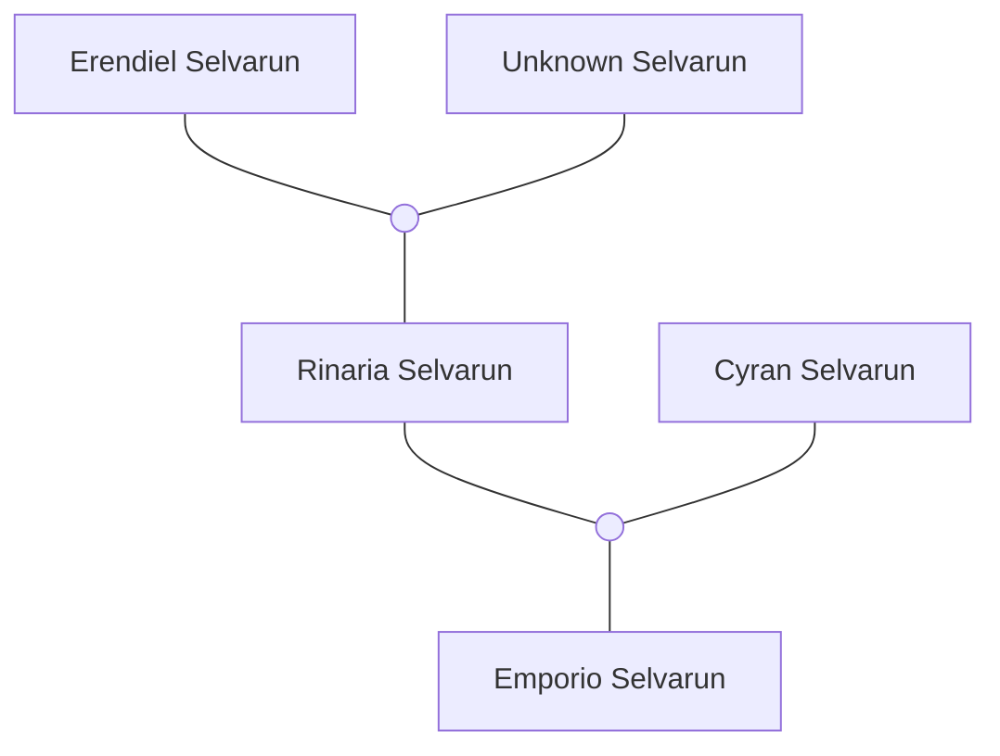

Die Familie Selvarun ist ein Clan von Glasbläsern aus [[Fellonhall]] und eines der [[5 Gründungshäuser von Fellonhall]].
Sie haben an der Entwicklung des [[Wall|Walls]] mitgewirkt.

## Bekannte Mitglieder der Familie
- [[Erendiel Selvarun]]
- [[Unknown Selvarun]]
- [[Rinaria Selvarun]]
- [[Cyran Selvarun]]
- [[Emporio Selvarun]]

## Facts
Eines der Gründungshäuser von Fallonhall.
Kleinstes und unbekanntestes der Gründungshäuser.
Ist außerhalb von Fellonhall nur wenigen bekannt.
Lebt im Norden von Fallenhall
Der wenige Einfluss des Hauses stammt hauptsächlich von gesellschaftlichem Prestige.; "Es ist cool einen Selvarun auf der Party zu haben".
(Nach Errichtung des Walls ist der Prestige stark gestiegen).
Neben politischen Connections bewegt sich das Haus hauptsächlich in höheren Gesellschaftsschichten. (Reiche Kunden für Kunstwerke)

Das Haus ist bekannt für die begnadeten Glasbläser / Glashandwerker die es hervorbringt.
Familienerbe besteht aus verschiedenen „Kunstwerken“ und antiker Magie.
Kunstwerke sind oft magische Items, aber nicht immer. (Glaskuppel der Halle in Am’Jarr?)
Jeder bedeutende  Selvarun hat der Wellt mindestens ein bekanntes Kunstwerk hinterlassen.

Jeder de Familie war schon immer auf eine eigene Art „extra“, bisschen verrückt oder außerhalb der norm. Manche mehr, manche weniger.

## Der Wall
Nach Mondfall arbeiten alle Selvaruns zusammen, um bei der Errichtung des Wall zu helfen.

Aktivierung Des Walls ist nicht ohne einen „Katalysator“ in jedem der 3 Türme möglich. Drei Selvaruns opfern sich, um den Wall in betrieb zu nehmen. Bis heute steht in Zentrum jeden Turms ein zu Glas gewordener Selvarun (Petrified aber zu Glas)

## Magie
Magische Eigenschaften der Kunstwerke und Zauber der Selvaruns.
- Schutz und Versieglungszauber (Shield, Wall of Force, [Staff of Defense](https://5e.tools/items.html#staff%20of%20defense_lmop))
- Shatter. Weil glas zerbrechen kann.
- Auf Sicht begrenzte Illusionszauber. Licht wird von Glas gebrochen
- Auf Sicht begrenzte Divination Zauber. Magische Brillen und Spiegel.
- Zuber wie Transmute Stone aber halt für glas

## Inspiration
**Prince Rupert's drop:**
Phänomen aus der echten Welt.
Wenn man geschmolzenes Glas in Wasser tropfen lässt wird der Tropfen durch den Abkühlprozess extrem Hart. Wird das dünne ende des Tropfens abgebrochen explodiert der gesamte Tropfen.

**Ästhetik:**
Unter Ästhetik verstehe ich ein groben common denominator wie die Selvaruns und ihre Kunst auftreten. Natürlich ist jeder Selvarun eigen

Ich sehe da aber 2 mögliche stiele:
- V1: alles ist perfekt durchsichtigem und ungefärbtem glas geformt. „rein“, "perfektionistisch"
- V2: Verschiedene Buntgläser zusammengesetzt. „chaotisch“, „kreativ“

Vielleicht machen alle Selvaruns einfach beides oder eine Mischung. Oder vielleicht ist das so ein Generationen ding. Die einen machen eher v1 die anderen eher v2. 